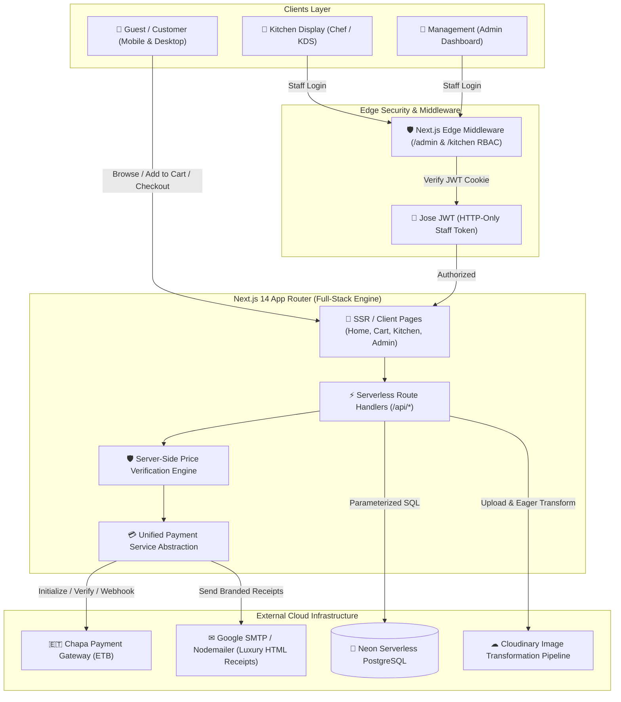

# 👑 Golden Hotel — Digital Menu & Hospitality Platform

[](https://nextjs.org/)
[](https://react.dev/)
[](https://www.typescriptlang.org/)
[](https://tailwindcss.com/)
[](https://neon.tech/)
[](https://chapa.co/)
[](https://cloudinary.com/)
[](#)

> **A luxury, full-stack omnichannel restaurant and in-room dining management system.** Designed specifically for high-end hospitality venues, featuring real-time kitchen operations (KDS), dual-rail payment settlement (Cash on Delivery & Chapa ETB digital gateway), table/room QR code generation with printable tent cards, home delivery dispatch, and multi-role staff access control.

---

## 📑 Table of Contents

- [Architectural Overview](#-architectural-overview)
- [Key Capabilities](#-key-capabilities)
  - [1. Guest Dining Experience](#1-guest-dining-experience-omnichannel)
  - [2. Dual-Rail Payment Engine](#2-dual-rail-payment-engine-cash--chapa-etb)
  - [3. Kitchen Display System (KDS)](#3-kitchen-display-system-kds)
  - [4. Executive Admin Control Center](#4-executive-admin-control-center)
  - [5. Dynamic QR Code & Printable Cards](#5-dynamic-qr-code--printable-cards)
  - [6. Enterprise Security & RBAC](#6-enterprise-security--rbac)
- [Technology Stack](#-technology-stack)
- [System State Machines](#-system-state-machines)
- [Project Directory Structure](#-project-directory-structure)
- [Database Schema & Entities](#-database-schema--entities)
- [Getting Started](#-getting-started)
  - [Prerequisites](#prerequisites)
  - [Installation](#installation)
  - [Environment Variables](#environment-variables)
  - [Database Migrations & Seeding](#database-migrations--seeding)
  - [Running the Development Server](#running-the-development-server)
- [Automated Scripts & Diagnostics](#-automated-scripts--diagnostics)
- [REST API Reference](#-rest-api-reference)
- [Default Staff Credentials](#-default-staff-credentials)
- [Production Deployment (Vercel)](#-production-deployment-vercel)
- [Security & Integrity Protections](#-security--integrity-protections)

---

## 🏛 Architectural Overview



---

## ✨ Key Capabilities

### 1. Guest Dining Experience (Omnichannel)
- **Multi-Fulfillment Modes**: Supports **In-Room Dining** (Room #), **Dine-In** (Table #), and **Home Delivery** (Full name, phone, sub-city/area, street address, and special drop-off notes).
- **Persistent Cart Engine**: Built with **Zustand** and local storage persistence (`golden-hotel-cart-v5`), ensuring guests never lose their selection across reloads or page transitions.
- **Smart Category Browsing & Live Search**: Instant multi-keyword search, dynamic category filtering, responsive item counter, and dedicated "Today's Special" highlights.
- **Live Order Tracking**: Real-time status tracker with celebratory milestone animations (`canvas-confetti`) when orders reach completed/paid milestones.
- **Luxury Aesthetic**: Bespoke dark-emerald and gold design system (`#0B1F1A`, `#D4AF37`) tailored for fine-dining ambiance.

### 2. Dual-Rail Payment Engine (Cash & Chapa ETB)
- **Ethiopian Birr (ETB) Digital Gateway**: Direct integration with **Chapa**, supporting Telebirr, CBE Birr, cards, and mobile banking.
- **Tamper-Proof Trusted Pricing**: Prices submitted by the client are **never trusted**. The backend derives every line item's price directly from the PostgreSQL catalog and adds the server-configured flat delivery fee before initializing charges.
- **Webhook & Return URL Verification**: Dual-phase verification through signed webhooks (`x-chapa-signature` HMAC SHA-256) and synchronous return URL verification.
- **Cash Flow Reconciliation**: Cash orders start as `UNPAID` and require explicit physical verification by floor staff or admins, logging the staff user ID and email in the transaction ledger.

### 3. Kitchen Display System (KDS)
- **Dedicated Chef View (`/kitchen`)**: High-contrast, tactile interface designed for tablets and touchscreens in hot, fast-paced kitchen environments.
- **Real-Time Order Ingestion**: 4-second non-blocking polling engine with real-time audio chime triggers when new tickets arrive.
- **5-Stage Order Lifecycle**:
  `new` ➔ `cooking` (with timer) ➔ `ready` ➔ `out_for_delivery` ➔ `delivered`
- **Granular Stage Timestamps**: Automatically captures `started_at`, `ready_at`, `out_for_delivery_at`, and `delivered_at` for operational SLA tracking.

### 4. Executive Admin Control Center (`/admin`)
- **Executive Analytics Dashboard**: Live metrics for Total Gross Revenue, Cash Revenue, Digital Chapa Revenue, Outstanding/Unpaid Revenue, and Active Tickets.
- **Menu Items Manager**: Complete CRUD operations, real-time availability toggles, sorting order controls, and direct Cloudinary image upload.
- **Category Taxonomy Management**: Create, reorganize, and maintain food and beverage categories.
- **Live Order Management**: Filter orders by fulfillment mode (Hotel vs Delivery), update preparation stages, view delivery directions, and verify cash collection.
- **Financial Audit Ledger**: Comprehensive payment audit table linking transaction IDs, provider reference numbers, customer emails, and payment dates.

### 5. Dynamic QR Code & Printable Cards
- **Instant Table/Room Linking**: Generates universal or location-encoded QR codes linking directly to the digital menu.
- **Printable Luxury Tent Cards**: Features a CSS print layout (`#qr-print-card`) formatted with Golden Hotel luxury branding, ready for immediate physical printing or high-resolution PNG export.

### 6. Enterprise Security & RBAC
- **Next.js Edge Middleware Protection**: Route interceptor (`src/middleware.ts`) enforcing role separation:
  - `/admin/*` requires `role === "admin"`
  - `/kitchen/*` requires `role === "chef"` or `role === "admin"`
- **Stateless Jose JWTs**: Authenticated sessions stored in secure, `httpOnly`, `sameSite: lax` cookies.
- **Bcrypt Password Security**: Passwords stored using adaptive salt rounds.
- **Self-Service Password Recovery**: Secure tokenized password reset links sent via email (`/forgot-password` and `/reset-password`).

---

## 🛠 Technology Stack

| Layer | Technologies | Details / Rationale |
| :--- | :--- | :--- |
| **Framework** | Next.js 14 (App Router) | Server Components, Edge Middleware, Route Handlers |
| **Language** | TypeScript 5 | Strict typing across shared client/server interfaces |
| **UI & Styling** | Tailwind CSS 3.4, Vanilla CSS | Bespoke luxury green & gold theme palette, responsive grid |
| **Icons & Media** | Lucide React, Canvas Confetti | Lightweight SVGs and celebratory micro-interactions |
| **State Management** | Zustand 5 | Client store with selective JSON serialization & localStorage |
| **Database** | Neon Serverless PostgreSQL | Auto-scaling serverless Postgres via `@neondatabase/serverless` |
| **Payment Gateway**| Chapa API (ETB), BirrPay Provider | Extensible multi-provider payment service architecture |
| **Asset Storage** | Cloudinary v2 SDK | Automated WebP compression, auto-crop, eager thumbnail generation |
| **Authentication** | Jose & BcryptJS | Edge-compatible JWT signing and salted credential hashing |
| **Email Service** | Nodemailer (Gmail SMTP) | High-fidelity HTML receipt generation and password reset tokens |

---

## 🔄 System State Machines

### Order Status Lifecycle
```text
  ┌──────────┐
  │   new    │ ─── Chef accepts ticket
  └────┬─────┘
       │ (Captures started_at)
       ▼
  ┌──────────┐
  │ cooking  │ ─── Food preparation finished
  └────┬─────┘
       │ (Captures ready_at)
       ▼
  ┌──────────┐
  │  ready   │
  └────┬─────┘
       │
       ├─────────────────────────────────────────┐
       │ (For Home Delivery)                     │ (For In-House Hotel)
       ▼                                         ▼
┌──────────────────┐                     ┌───────────────┐
│ out_for_delivery │                     │   delivered   │
└────────┬─────────┘                     └───────────────┘
         │ (Captures out_for_delivery_at)        ▲
         │                                       │
         └────── Courier completes handoff ──────┘
                 (Captures delivered_at)
```

> **Important Operational Rule**: `status = delivered` does **not** mark an order as `PAID`. Cash payments must be individually confirmed by staff upon receiving physical currency.

### Payment Status Lifecycle
```text
                ┌──────────────┐
                │ Initial Order│
                └──────┬───────┘
                       │
         ┌─────────────┴─────────────┐
         ▼                           ▼
  [ Cash Selected ]          [ Digital / Chapa ]
         │                           │
         ▼                           ▼
  ┌──────────────┐            ┌──────────────┐
  │    UNPAID    │            │   PENDING    │
  └──────┬───────┘            └──────┬───────┘
         │                           │
         │ Staff Confirms Cash       ├──────────────┬──────────────┐
         ▼                           ▼              ▼              ▼
  ┌──────────────┐            ┌─────────────┐ ┌───────────┐ ┌───────────┐
  │     PAID     │            │    PAID     │ │  FAILED   │ │ REFUNDED  │
  └──────────────┘            └─────────────┘ └───────────┘ └───────────┘
```

---

## 📂 Project Directory Structure

```text
Digital-Menu/
├── .env.example              # Comprehensive environment configuration template
├── .env.local                # Local private credentials (git-ignored)
├── next.config.mjs           # Next.js config (Cloudinary remotePatterns, redirects)
├── package.json              # Project scripts and dependencies
├── tailwind.config.ts        # Custom luxury theme (gold & green colors, fonts)
├── tsconfig.json             # Strict TypeScript configuration
├── scripts/                  # Operations, migrations, and automated test suites
│   ├── ensureStaffUsers.ts   # Seeds default admin & chef accounts with bcrypt
│   ├── inspect-db.ts         # Diagnostic script showing table counts & previews
│   ├── inspect-orders-table.ts# Verifies schema columns and order indexes
│   ├── migrate-delivery.ts   # Schema migration: home delivery fields & indices
│   ├── migrate-payments.ts   # Schema migration: payments table & stage timestamps
│   ├── reset-orders.ts       # Safely clears test orders while preserving catalog
│   └── test-scenarios.ts     # Automated end-to-end integration test runner
└── src/
    ├── middleware.ts         # Edge JWT verification and route guard for /admin & /kitchen
    ├── types.ts              # Canonical TypeScript interfaces (Order, Payment, MenuItem)
    ├── app/                  # Next.js 14 App Router pages and API routes
    │   ├── layout.tsx        # Global HTML shell, Google Fonts (Playfair, Inter), Navbar
    │   ├── page.tsx          # Guest-facing digital menu with search and filters
    │   ├── cart/page.tsx     # Guest cart, checkout, delivery form, live order tracking
    │   ├── kitchen/page.tsx  # Kitchen Display System (KDS) for culinary staff
    │   ├── admin/page.tsx    # Executive 6-tab Admin Management Dashboard
    │   ├── staff-login/      # Unified staff authentication gateway (Admin & Chef)
    │   ├── forgot-password/  # Self-service password reset request
    │   ├── reset-password/   # Tokenized password reset form
    │   └── api/
    │       ├── auth/         # Login, logout, forgot-password, reset-password handlers
    │       ├── categories/   # Category listing and creation endpoints
    │       ├── menu-items/   # Menu item CRUD operations with cache invalidation
    │       ├── orders/       # Order creation with price validation & status patching
    │       │   └── [id]/     # Single order retrieval and stage timestamp patching
    │       ├── payments/     # Chapa initiation, verification, cash confirm, webhooks
    │       ├── upload/       # Cloudinary media upload with automated WebP transforms
    │       └── cron/         # Scheduled serverless database keep-warm endpoint
    ├── components/           # Reusable UI component library
    │   ├── Navbar.tsx        # Dynamic navigation bar with role badge & cart count
    │   ├── MenuItemCard.tsx  # Interactive dish card with quantity selector
    │   ├── CategoryFilters.tsx# Horizontal scrolling category selection pills
    │   ├── CartStickyButton.tsx# Mobile floating action button showing cart total
    │   ├── OrderTypeModal.tsx# Initial modal for choosing Dine-In vs Delivery
    │   ├── StaffLogoutButton.tsx# Secure session termination button
    │   └── Toast.tsx         # Contextual notifications (Success, Error, Warning)
    ├── lib/                  # Server-side core utilities and business logic
    │   ├── db.ts             # Neon serverless PostgreSQL connection client
    │   ├── config.ts         # Centralized application constants (delivery fee, currency)
    │   ├── cloudinary.ts     # Cloudinary SDK client configuration
    │   ├── image.ts          # Client-side image URL optimization helper
    │   ├── email.ts          # Nodemailer transporter & luxury HTML receipt builder
    │   └── payments/         # Multi-provider payment service abstraction
    │       ├── types.ts      # IPaymentProvider contract definition
    │       ├── service.ts    # PaymentService business logic, stats, & webhooks
    │       ├── chapa.ts      # Chapa API integration (ETB checkout & verify)
    │       └── birrpay.ts    # BirrPay driver stub
    └── store/
        └── useStore.ts       # Zustand client store (cart, delivery info, order types)
```

---

## 🗄 Database Schema & Entities

The application runs on PostgreSQL (hosted on Neon Serverless) and consists of 7 interconnected entities:

```text
┌────────────────┐       ┌─────────────────┐       ┌────────────────────────┐
│   categories   │       │   menu_items    │       │         users          │
├────────────────┤       ├─────────────────┤       ├────────────────────────┤
│ id (PK)        │───┐   │ id (PK)         │       │ id (PK)                │
│ name           │   └──<│ category_id(FK) │       │ email (UNIQUE)         │
│ created_at     │       │ name            │       │ password_hash          │
└────────────────┘       │ description     │       │ role ('admin'|'chef')  │
                         │ price           │       │ created_at             │
                         │ image_url       │       └────────────────────────┘
                         │ available       │                   │
                         │ sort_order      │                   │
                         │ created_at      │                   ▼
                         └────────┬────────┘       ┌────────────────────────┐
                                  │                │ password_reset_tokens  │
                                  │                ├────────────────────────┤
                                  ▼                │ id (PK)                │
┌──────────────────────────────────────┐           │ user_id (FK -> users)  │
│                orders                │           │ token (UNIQUE)         │
├──────────────────────────────────────┤           │ expires_at             │
│ id (PK)                              │           │ used (BOOLEAN)         │
│ order_type ('HOTEL' | 'DELIVERY')    │           │ created_at             │
│ delivery_location (Table/Room)       │           └────────────────────────┘
│ delivery_name, phone, address, area  │
│ delivery_address_details, notes      │
│ delivery_fee (NUMERIC)               │
│ special_instructions                 │
│ total_amount (NUMERIC)               │
│ status ('new'|'cooking'|'ready'|...) │
│ started_at, ready_at, out_for_...    │
│ delivered_at, created_at             │
└──────────────┬───────────────────────┘
               │
        ┌──────┴────────────────────────┐
        ▼                               ▼
┌─────────────────────────┐   ┌──────────────────────────────────┐
│       order_items       │   │             payments             │
├─────────────────────────┤   ├──────────────────────────────────┤
│ id (PK)                 │   │ id (PK)                          │
│ order_id (FK -> orders) │   │ order_id (FK -> orders)          │
│ menu_item_id (FK)       │   │ amount (NUMERIC)                 │
│ name                    │   │ currency ('ETB')                 │
│ price                   │   │ method ('CASH' | 'DIGITAL')      │
│ quantity                │   │ status ('UNPAID'|'PAID'|...)     │
└─────────────────────────┘   │ provider ('CHAPA' | 'BIRRPAY')   │
                              │ provider_payment_id, tx_id       │
                              │ checkout_url                     │
                              │ paid_at                          │
                              │ paid_by (FK -> users)            │
                              │ paid_by_email                    │
                              │ metadata (JSONB)                 │
                              │ created_at, updated_at           │
                              └──────────────────────────────────┘
```

---

## 🚀 Getting Started

### Prerequisites
- **Node.js**: `v18.17.0` or higher (`v20+` recommended)
- **npm**, **pnpm**, or **yarn**
- **Neon PostgreSQL**: A free serverless database instance on [neon.tech](https://neon.tech)
- **Cloudinary Account**: For automatic menu image transformations ([cloudinary.com](https://cloudinary.com))
- **Chapa Account**: For digital payment collection in ETB ([chapa.co](https://chapa.co))
- **Gmail Account**: With an App Password for transactional receipts and password resets

### Installation

1. **Clone the repository:**
   ```bash
   git clone https://github.com/riyadd-o/ghms.git
   cd ghms
   ```

2. **Install project dependencies:**
   ```bash
   npm install
   ```

3. **Configure Environment Variables:**
   Copy the `.env.example` template into `.env.local`:
   ```bash
   cp .env.example .env.local
   ```
   Open `.env.local` and provide your database credentials, API keys, and secrets.

---

### Environment Variables

| Variable | Required | Default | Description |
| :--- | :---: | :---: | :--- |
| `DATABASE_URL` | **Yes** | — | PostgreSQL connection string (Neon serverless pooled URL) |
| `JWT_SECRET` | **Yes** | — | Secret key used to sign and verify staff authentication tokens |
| `CRON_SECRET` | **Yes** | — | Authorization token for protecting `/api/cron/keep-warm` |
| `NEXT_PUBLIC_BASE_URL` | **Yes** | `http://localhost:3000` | Host URL for payment redirects, tracking links, and callbacks |
| `NEXT_PUBLIC_DELIVERY_FEE`| No | `100` | Fixed flat delivery charge in Ethiopian Birr (ETB) |
| `ACTIVE_PAYMENT_PROVIDER`| No | `CHAPA` | Active digital payment gateway (`CHAPA` or `BIRRPAY`) |
| `CHAPA_SECRET_KEY` | **Yes** | — | Chapa Secret Key (`CHASECK_...`) for initializing charges |
| `CHAPA_PUBLIC_KEY` | No | — | Chapa Public Key (`CHAPUBK_...`) |
| `CHAPA_BASE_URL` | No | `https://api.chapa.co` | Chapa API base URL |
| `CHAPA_WEBHOOK_SECRET` | No | — | Secret token/hash for validating Chapa webhook authenticity |
| `CLOUDINARY_CLOUD_NAME` | **Yes** | — | Cloudinary cloud identifier |
| `CLOUDINARY_API_KEY` | **Yes** | — | Cloudinary API key |
| `CLOUDINARY_API_SECRET` | **Yes** | — | Cloudinary API secret |
| `GMAIL_USER` | **Yes** | — | Gmail address used to dispatch receipts & recovery emails |
| `GMAIL_APP_PASSWORD` | **Yes** | — | 16-character Google App Password (not your personal password) |

---

### Database Migrations & Seeding

The repository includes standalone TypeScript scripts to migrate the database and seed default administrative staff users:

1. **Run Home Delivery Migration** (adds delivery columns and indexes to `orders`):
   ```bash
   npx tsx scripts/migrate-delivery.ts
   ```

2. **Run Payments Migration** (creates `payments` table, stage timestamps, and indexes):
   ```bash
   npx tsx scripts/migrate-payments.ts
   ```

3. **Seed Default Staff Accounts** (creates admin & chef users with bcrypt hashes):
   ```bash
   npx tsx scripts/ensureStaffUsers.ts
   ```

---

### Running the Development Server

Start the local Next.js development server:
```bash
npm run dev
```

Open [http://localhost:3000](http://localhost:3000) in your browser:
- **Guest Digital Menu**: [http://localhost:3000](http://localhost:3000)
- **Guest Cart & Tracking**: [http://localhost:3000/cart](http://localhost:3000/cart)
- **Kitchen Display System (KDS)**: [http://localhost:3000/kitchen](http://localhost:3000/kitchen)
- **Executive Admin Dashboard**: [http://localhost:3000/admin](http://localhost:3000/admin)
- **Staff Login**: [http://localhost:3000/staff-login](http://localhost:3000/staff-login)

---

## ⚙ Automated Scripts & Diagnostics

The project provides dedicated scripts in the `scripts/` directory executed via `npx tsx`:

| Command | Purpose |
| :--- | :--- |
| `npx tsx scripts/inspect-db.ts` | Displays total row counts for all tables and prints sample active orders and payments. |
| `npx tsx scripts/inspect-orders-table.ts` | Inspects current column data types and constraints on the `orders` table. |
| `npx tsx scripts/reset-orders.ts` | Safely clears orders and payments for development/testing without touching menu items or users. |
| `npx tsx scripts/test-scenarios.ts` | Runs automated integration tests verifying Hotel Cash orders, Delivery Chapa orders, and status transitions. |
| `npm run lint` | Runs ESLint over the entire codebase. |
| `npm run build` | Produces a production-ready standalone build. |

---

## 🔌 REST API Reference

### Authentication (`/api/auth`)
- `POST /api/auth/login`: Authenticates staff (email, password, role) and issues an HTTP-only JWT cookie (`staff_token`).
- `POST /api/auth/logout`: Clears the session cookie.
- `POST /api/auth/forgot-password`: Generates a time-limited password reset token and emails it to the staff member.
- `POST /api/auth/reset-password`: Validates the reset token and updates the user's Bcrypt password hash.

### Orders (`/api/orders`)
- `GET /api/orders`: Retrieves all orders sorted by creation date with items, timestamps, and payment details.
- `POST /api/orders`: Submits a new order. Validates table/room or delivery address, verifies line-item prices server-side, calculates totals, and creates payment records.
- `GET /api/orders/:id`: Fetches detailed status, item breakdown, and payment details for a specific order.
- `PATCH /api/orders/:id`: Updates an order's lifecycle stage (`cooking`, `ready`, `out_for_delivery`, `delivered`) and stamps the corresponding timestamp.

### Payments (`/api/payments`)
- `POST /api/payments/create`: Initializes a payment for an existing order. Generates a Chapa hosted checkout URL for digital orders.
- `GET|POST /api/payments/verify`: Verifies transaction status with the provider (or queries current status) and marks payment as `PAID`.
- `POST /api/payments/confirm-cash`: Authenticated endpoint allowing staff to mark physical cash as received.
- `POST /api/payments/webhook`: Handles asynchronous Chapa webhooks with cryptographic HMAC signature verification.
- `GET /api/payments/stats`: Returns financial metrics (Gross, Cash, Digital, Outstanding revenue).

### Menu & Media
- `GET /api/categories`: Returns all food and beverage categories.
- `POST /api/categories`: Adds a new category (admin).
- `GET /api/menu-items`: Returns all available menu items with category names and optimized image URLs.
- `POST /api/menu-items`: Adds a new dish (admin).
- `POST /api/upload`: Uploads a dish photo to Cloudinary, applying auto-crop, quality optimization, and WebP conversion.

### Operational Cron
- `GET /api/cron/keep-warm`: Executes a lightweight query against Neon PostgreSQL to prevent serverless database cold starts. Requires `Authorization: Bearer <CRON_SECRET>`.

---

## 👥 Default Staff Credentials

When seeded via `scripts/ensureStaffUsers.ts`, the following staff accounts are initialized:

| Role | Email | Password | Access Rights |
| :--- | :--- | :--- | :--- |
| **Administrator** | `admin@goldenhotel.com` | `admin123` | Full access: `/admin`, `/kitchen`, menu editing, cash confirm |
| **Chef / Kitchen**| `chef@goldenhotel.com`  | `kitchen123` | Access to `/kitchen` (KDS) order management |

> **Security Notice**: Change these default passwords immediately upon deploying to any staging or production environment.

---

## ☁ Production Deployment (Vercel)

This application is optimized for zero-configuration deployment on **Vercel**.

1. **Push your code to GitHub / GitLab.**
2. **Import the repository into Vercel.**
3. **Configure Environment Variables in Vercel:**
   - Add all variables listed in `.env.example` to the Vercel project settings (**Settings ➔ Environment Variables**).
   - Set `NEXT_PUBLIC_BASE_URL` to your production domain (e.g., `https://menu.goldenhotel.com`).
4. **Vercel Cron Keep-Warm (Optional but Recommended):**
   Add a `vercel.json` file in the root if you want Vercel Cron to invoke `/api/cron/keep-warm` every 10 minutes:
   ```json
   {
     "crons": [
       {
         "path": "/api/cron/keep-warm",
         "schedule": "*/10 * * * *"
       }
     ]
   }
   ```
5. **Deploy:**
   Click **Deploy**. Vercel will build the Next.js production bundle and deploy globally to the edge.

---

## 🛡 Security & Integrity Protections

1. **Server-Side Price Validation**: The client-side shopping cart never specifies the final price. Every dish's price is queried directly from the Neon database by item ID, eliminating browser-side price manipulation.
2. **Cryptographic Webhook Signatures**: Incoming payment webhooks from Chapa are validated using SHA-256 HMAC signatures (`x-chapa-signature`).
3. **Protected Staff Cookies**: Session tokens use signed JSON Web Tokens (`HS256` via `jose`) with `httpOnly`, `sameSite: lax`, and strict path restrictions.
4. **SQL Injection Defense**: All database queries are executed using tagged template literals provided by `@neondatabase/serverless`, which automatically escape and parameterize inputs.
5. **Defensive Cash Verification**: Orders marked as `delivered` remain `UNPAID` until an authorized staff member confirms physical receipt of cash, creating an immutable audit trail.

---

## 📄 License

Proprietary software. All rights reserved by **Golden Hotel**. Unauthorized copying, distribution, or modification is strictly prohibited.
